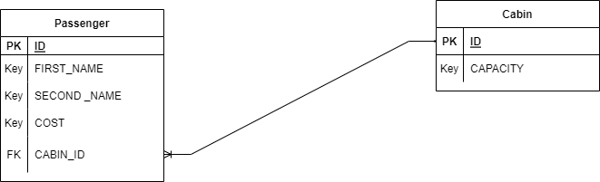

# Silverline project
Sql code:-
`CREATE TABLE `passenger` (
  `ID` int NOT NULL AUTO_INCREMENT,
  `First_Name` varchar(255) NOT NULL,
  `Last_Name` varchar(255) NOT NULL,
  `Cost` double DEFAULT NULL,
  `C_ID` int DEFAULT NULL,
  PRIMARY KEY (`ID`),
  KEY `fk_CabinID` (`C_ID`),
  CONSTRAINT `fk_CabinID` FOREIGN KEY (`C_ID`) REFERENCES `cabin` (`Cabin_ID`)
) ENGINE=InnoDB AUTO_INCREMENT=11 DEFAULT CHARSET=utf8mb4 COLLATE=utf8mb4_0900_ai_ci

CREATE TABLE `cabin` (
  `Cabin_ID` int NOT NULL,
  `Capacity` int DEFAULT NULL,
  PRIMARY KEY (`Cabin_ID`)
) ENGINE=InnoDB DEFAULT CHARSET=utf8mb4 COLLATE=utf8mb4_0900_ai_ci`

